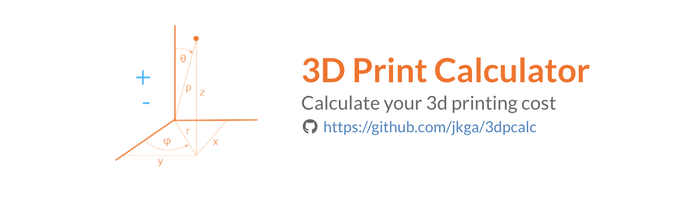

# 3dpcalc
3d print calculator   
website: https://3dpcalc.vercel.app/

This application aims to provide the 3d printing community an easy and intuitive way of calculating printing costs based on actual consumption.

Features:
- [x] Price/gram of unprocessed filament
- [x] Price/gram of 3d printed model
- [x] Price/hour of 3d printed model
- [x] Price/hour of power consumption based on the most recent electricity bill
- [x] Estimated Price/hour of power consumption based on the device power rating
- [ ] 3d printer's profile evaluation
- [ ] Preset for know 3d printers
- [ ] Support for resin printers
- [x] Optional additional costs (setup fee, packaging, delivery, etc...)
- [x] Markup computation
- [ ] PDF Export
